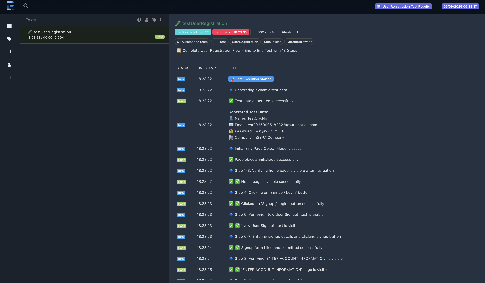

# 🚀 Selenium Java Automation Framework

[](https://www.oracle.com/java/)
[](https://maven.apache.org/)
## 🏛️ Framework Architectureps://img.shields.io/badge/Selenium-4.15.0-green.svg)](https://selenium.dev/)
[](https://testng.org/)
[](LICENSE)

A comprehensive automation testing framework built with **Selenium WebDriver**, **Java**, and **TestNG**, implementing **Page Object Model (POM)** design pattern with industry best practices.

## 🎯 Test Scenario

This framework demonstrates a complete **User Registration Flow** with 18 automated steps:

1. ✅ Launch browser and navigate to automation exercise website
2. ✅ Verify home page visibility
3. ✅ Navigate to signup/login page
4. ✅ Complete user registration process
5. ✅ Verify account creation and login
6. ✅ Clean up by deleting the test account

## 🏗️ Project Architecture

```
selenium-web-java/
├── 📁 src/main/java/com/automation/
│   ├── 📁 base/              # Base classes
│   ├── 📁 pages/             # Page Object Model classes
│   └── 📁 utils/             # Utility classes
├── 📁 src/test/java/com/automation/tests/
│   └── 📄 UserRegistrationTest.java
├── 📁 src/test/resources/
│   ├── 📄 config.properties  # Test configuration
│   └── 📄 testng.xml         # TestNG suite
├── 📄 pom.xml                # Maven dependencies
└── 📄 README.md
```

## ✨ Key Features

🔹 **Page Object Model (POM)** - Clean separation of concerns  
🔹 **TestNG Framework** - Robust testing with annotations  
🔹 **WebDriverManager** - Automatic driver management  
🔹 **Dynamic Test Data** - Random data generation  
🔹 **Professional ExtentReports** - Dark theme with interactive dashboards  
🔹 **Screenshot Capture** - Auto-capture on failures with detailed logging  
🔹 **Cross-browser Testing** - Chrome, Firefox, Safari, Edge  
🔹 **Configuration Management** - Externalized settings

## 🛠️ Tech Stack

| Technology | Version | Purpose |
|------------|---------|---------|
| **Java** | 11+ | Programming Language |
| **Maven** | 3.6+ | Build & Dependency Management |
| **Selenium WebDriver** | 4.15.0 | Browser Automation |
| **TestNG** | 7.8.0 | Test Framework |
| **WebDriverManager** | 5.6.2 | Driver Management |
| **ExtentReports** | 5.1.1 | Test Reporting |
| **Apache Commons Lang** | 3.13.0 | Utilities |

## 📋 Prerequisites

- ☕ **Java 11** or higher
- 📦 **Maven 3.6** or higher  
- 🌐 **Chrome/Firefox/Safari** browser
- 🍎 **macOS/Windows/Linux** operating system

## 🚀 Quick Start

### 1️⃣ Clone Repository
```bash
git clone https://github.com/adityadwic/selenium-web-java.git
cd selenium-web-java
```

### 2️⃣ Install Dependencies
```bash
mvn clean install
```

### 3️⃣ Run Tests
```bash
# Run all tests
mvn test

# Run specific test
mvn test -Dtest=UserRegistrationTest

# Run with specific browser
mvn test -Dbrowser=firefox

# Run in headless mode
mvn test -Dheadless=true
```

## 🎛️ Configuration

Configure your tests via `src/test/resources/config.properties`:

```properties
# Browser Configuration
browser=chrome                    # chrome, firefox, safari, edge
headless=false                   # true for headless mode
window.maximize=true             # maximize browser window

# Test Configuration  
url=http://automationexercise.com # application URL
timeout=10                       # implicit wait timeout (seconds)

# Reporting
screenshot.on.failure=true       # capture screenshots on failure
```

## 🧪 Running Tests

### Basic Commands

```bash
# Compile and run all tests
./run-tests.sh                   # For Unix/macOS users

# Cross-browser testing  
./run-cross-browser-tests.sh     # Test on multiple browsers

# Safari testing (macOS only)
./run-tests-safari.sh           # Safari-specific testing
```

### Advanced Commands

```bash
# Run tests with custom parameters
mvn test -Dbrowser=firefox -Dheadless=true -Dtimeout=15

# Run specific test groups
mvn test -Dgroups=smoke

# Generate reports only
mvn surefire-report:report
```

## 📊 Test Reports

After test execution, **professional-grade test reports** are generated with comprehensive details and visual appeal.

### 🎨 ExtentReports (Primary Reporting)
Our framework features a **sophisticated ExtentReports implementation** with:

#### ✨ **Key Features:**
- 🌙 **Dark Theme Professional** - Modern gradient UI design
- 📝 **Step-by-Step Logging** - Detailed 18-step execution tracking
- 📊 **Interactive Dashboard** - Real-time charts and statistics
- 🖼️ **Screenshot Integration** - Auto-capture on test events
- 💻 **System Information** - Environment and browser details
- 🎯 **Custom Styling** - Professional CSS with emoji indicators
- 📈 **Comprehensive Analytics** - Pass/fail metrics with visual charts

#### 📍 **Report Location:**
```bash
# ExtentReport HTML (Primary)
test-output/ExtentReport_[timestamp].html

# Example: 
test-output/ExtentReport_20250905_182317.html
```

#### 🚀 **View Reports:**
```bash
# Run test and generate ExtentReport
mvn test

# Open latest ExtentReport (macOS)
open test-output/ExtentReport_*.html

# Open latest ExtentReport (Linux)
xdg-open test-output/ExtentReport_*.html
```

#### **Latest Test Execution Results:**
```
✅ Test Suite: User Registration Test
✅ Total Tests: 1
✅ Passed: 1 (100%)
❌ Failed: 0 (0%)
⏭️ Skipped: 0 (0%)
⏱️ Execution Time: ~18 seconds
📅 Last Run: September 5, 2025
```

### 📋 **Traditional TestNG Reports (Secondary)**
- 📈 **TestNG HTML Report**: `test-output/index.html` 
- 📧 **Emailable Report**: `test-output/emailable-report.html`
- 📄 **TestNG XML**: `test-output/testng-results.xml`

### 🎯 **Report Sample**


### 📷 **Screenshots & Attachments**
- **Auto Screenshot Capture** on test failures
- **System Information** attachment
- **Test Data** logging and attachment
- **Step Screenshots** for detailed analysis

### 💡 **Pro Tips for Reports:**
```bash
# Quick test execution with report
./run-tests.sh

# Cross-browser testing with reports
./run-cross-browser-tests.sh

# Clean reports folder
rm -rf test-output/
```

> 🎉 **The ExtentReports provide a professional, portfolio-ready view of your test execution with detailed insights and beautiful visualizations!**

### 📋 XML Reports (For CI/CD)
- **TestNG XML**: `test-output/testng-results.xml`
- **JUnit XML**: `test-output/TEST-TestSuite.xml`

### 📷 Screenshots (On Failure)
- **Screenshots**: `test-output/screenshots/`

### � Quick View Report
```bash
# Run test and open report automatically
mvn test && open test-output/index.html
```

> 💡 **Tip**: Bookmark `test-output/index.html` for quick access to latest test results!

## 🏛️ Framework Architecture

### 🧩 Page Object Model

```java
// Example: HomePage.java
public class HomePage extends BasePage {
    @FindBy(xpath = "//a[contains(text(),'Signup / Login')]")
    private WebElement signupLoginButton;
    
    public void clickSignupLogin() {
        click(signupLoginButton);
    }
}
```

### 🔧 Base Classes

- **BaseTest**: WebDriver initialization, setup/teardown
- **BasePage**: Common page operations, waits, utilities

### 🛠️ Utilities

- **ConfigReader**: Configuration management
- **TestDataGenerator**: Dynamic test data creation  
- **ScreenshotUtils**: Screenshot capture utilities
- **ExtentReportManager**: Report generation

## 🧑‍💻 Development Setup

### For macOS Users

```bash
# Quick setup with Homebrew
./setup-mac.sh

# Manual setup
brew install openjdk@11 maven
brew install --cask google-chrome firefox
```

### For Windows Users

1. Install [Java 11 JDK](https://adoptopenjdk.net/)
2. Install [Maven](https://maven.apache.org/download.cgi)
3. Install [Chrome](https://www.google.com/chrome/) or [Firefox](https://www.mozilla.org/firefox/)
4. Add Java and Maven to PATH

### For Linux Users

```bash
# Ubuntu/Debian
sudo apt update
sudo apt install openjdk-11-jdk maven
sudo snap install chromium firefox

# CentOS/RHEL
sudo yum install java-11-openjdk maven
```

## 🔍 Sample Test Output

```bash
[INFO] Running com.automation.tests.UserRegistrationTest
✅ Home page is visible successfully
✅ 'New User Signup!' is visible  
✅ User registration completed
✅ 'ACCOUNT CREATED!' is visible
✅ 'Logged in as TestUser12345' is visible
✅ 'ACCOUNT DELETED!' is visible
[INFO] Tests run: 1, Failures: 0, Errors: 0, Skipped: 0
```

## 🐛 Troubleshooting

### Common Issues & Solutions

| Issue | Solution |
|-------|----------|
| **Driver not found** | WebDriverManager handles this automatically |
| **Element not found** | Increase timeout in `config.properties` |
| **Browser not launching** | Check browser installation and version |
| **Permission denied (macOS)** | Run `chmod +x *.sh` for scripts |
| **Java version issues** | Ensure Java 11+ is installed and in PATH |

### Debug Mode

```bash
# Run with verbose logging
mvn test -X

# Enable Selenium debug logs
mvn test -Dselenium.debug=true
```

## 📈 Best Practices Implemented

- ✅ **Page Object Model** for maintainable code
- ✅ **Explicit Waits** for reliable element interactions  
- ✅ **Data-driven Testing** with dynamic test data
- ✅ **Cross-browser Compatibility** 
- ✅ **Comprehensive Reporting** with screenshots
- ✅ **Configuration Management** via properties
- ✅ **Error Handling** and proper exception management
- ✅ **Clean Code** principles and naming conventions

## 🤝 Contributing

1. 🍴 Fork the repository
2. 🌿 Create a feature branch (`git checkout -b feature/AmazingFeature`)
3. 💾 Commit your changes (`git commit -m 'Add some AmazingFeature'`)
4. 📤 Push to the branch (`git push origin feature/AmazingFeature`)
5. 🔃 Open a Pull Request

## 📄 License

This project is licensed under the MIT License - see the [LICENSE](LICENSE) file for details.

## 👨‍💻 Author

**Aditya Dwi Cahyono**
- GitHub: [@adityadwic](https://github.com/adityadwic)
- LinkedIn: [Aditya Dwi Cahyono](https://linkedin.com/in/aditya-dwi-cahyono)

## 🙏 Acknowledgments

- [Selenium WebDriver](https://selenium.dev/) team for the amazing automation tools
- [TestNG](https://testng.org/) for the robust testing framework
- [Automation Exercise](http://automationexercise.com/) for providing the test website
- Open source community for continuous inspiration

## 📞 Support

If you find this project helpful, please ⭐ star this repository!

---

<div align="center">

**Happy Testing! 🚀**

Made with ❤️ by QA Engineers, for QA Engineers

</div>
